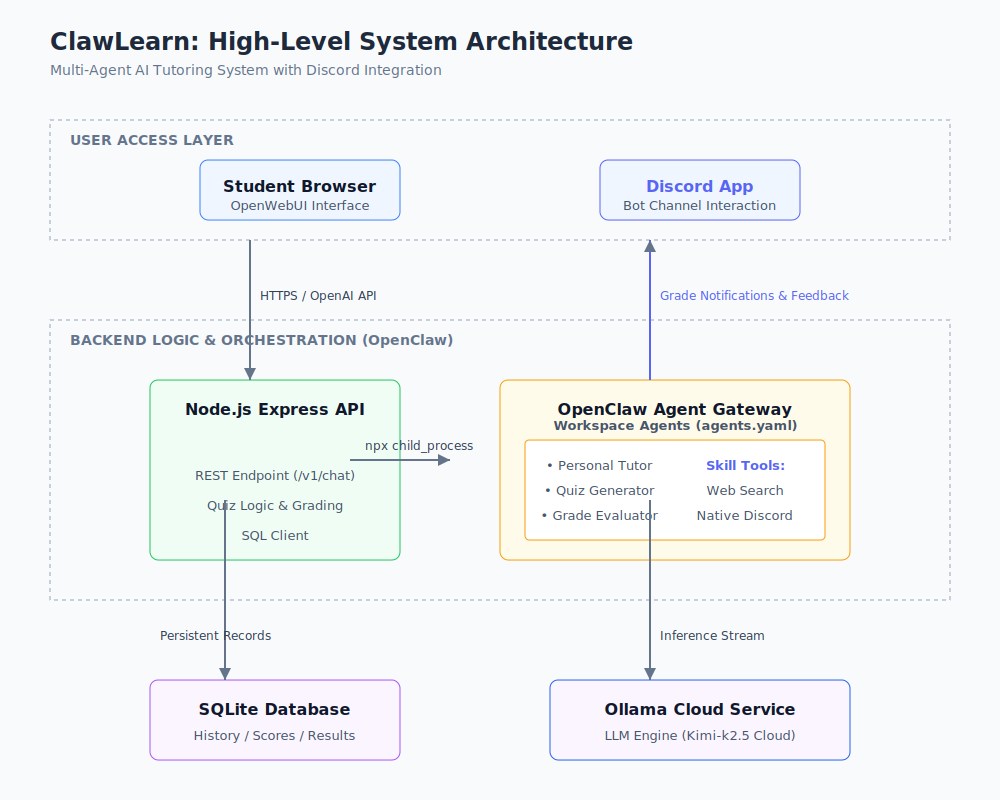

# ClawLearn - Personal AI Tutor (Offline/Cloud Hybrid)

ClawLearn is an AI tutor that adapts to how a student learns, explains concepts, generates quizzes, and tracks progress.
The entire app natively bridges a custom Node.js (Express) backend serving [OpenClaw](https://openclaw.ai/) agents to OpenWebUI for a fluid user experience.

## Tech Stack
- LLM: Ollama Cloud (`ollama/kimi-k2.5:cloud`)
- Agents: [OpenClaw](https://openclaw.ai/) Gateway (`openclaw gateway`) running locally along with defined `agents.yaml` tools.
- Backend: Node.js (Express) routing custom logic to [OpenClaw](https://openclaw.ai/) via `npx` child processes
- Storage: SQLite3 via `sqlite3` driver
- UI: OpenWebUI
## Architecture



## Quick Start
To set up and run ClawLearn on your machine, simply follow these steps:

1. **Start the Docker Containers**
   Initialize the system and securely pass your Ollama cloud API key by starting the Docker Compose stack:
   ```bash
   OLLAMA_API_KEY="your_api_key_here" docker compose up -d --build
   ```

2. **Onboard the [OpenClaw](https://openclaw.ai/) Daemon Local Package**
   The background Node.js daemon requires an interactive setup wizard to initialize its memory system. Since the daemon is now installed locally via your project's `package.json`, you must run this once:
   ```bash
   docker exec -it clawlearn-backend npx openclaw onboard
   ```
   *(Follow the prompts on your screen! [OpenClaw](https://openclaw.ai/) will configure your local models. Since we use `kimi-k2.5:cloud`, it will prompt you if it is missing. Make sure when asked for the Ollama URL, you MUST explicitly specify `http://ollama:11434` instead of the local 127.0.0.1 default so it can resolve through the container proxy network!)*

3. **Access the Application**
   - **OpenWebUI**: Open [http://localhost:3000](http://localhost:3000) in your browser. *(Note: The OpenWebUI container can take 1-3 minutes to become fully available on the first boot as it initializes its database. If it is not working immediately, please wait a minute or run `docker compose logs -f openwebui` to check its progress.)*

## Usage Guide
OpenWebUI is directly hooked up to the Node.js Express backend API via standard OpenAI connections to seamlessly serve agents.
When you chat:
1. Select one of the injected ClawLearn models in the top-left corner of OpenWebUI:
   - **`claw-tutor-agent`**: Adapts dynamically as a Personal Tutor to simplify and explain concepts.
   - **`claw-quiz-generator`**: Provide a topic in your prompt, and it generates and formats a targeted quiz.
2. The UI natively talks to the Express service (`localhost:8000/v1/chat/completions`).
3. Behind the scenes, the Express.js server leverages the official **`openclaw`** local module natively via Node `child_process.exec` hooks to contact the local API Gateway and seamlessly orchestrate your request across memory-enabled agents!

## How OpenClaw Simplified Implementation

The integration of the [OpenClaw](https://openclaw.ai/) framework drastically reduced the backend complexity of ClawLearn by abstracting away the heavy lifting of LLM orchestration. 

1. **Declarative Agent Workspaces**: Instead of manually passing messy, repetitive system prompts to an LLM script for every single contextual request across the application, OpenClaw helped by declaratively define isolated, specialized agents (like the `tutor-agent` and `quiz-generator`) in organized workspace configuration folders (`agent.yaml`). This permanently maps their persistent personas natively!
2. **Native Tool Calling & Cloud Logic**: OpenClaw handles the ingestion of complex tool directives (such as the initialized `web_search`) and properly routes logic over cloud-hosted protocols out of the box. This completely decoupled that burden from the Node.js Express wrappers!
3. **Dedicated Daemon Memory**: By delegating distinct agent states to the headless OpenClaw Gateway Daemon running locally in the background, conversational memory persistence and workspace session histories are automatically tracked by the agent runtime network instead of bloating our native SQLite database or application routing layers!